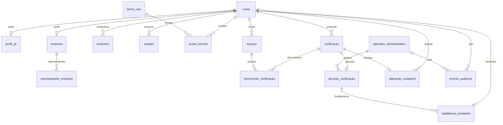

# SafraDireta — modelagem atual da Sprint 1

**Revisão:** 08/10/2026, após a migration `08_modelagem_essencial.sql`. Esta é a modelagem atual e substitui a descrição anterior da sprint. O dicionário abaixo foi extraído do PostgreSQL efetivamente atualizado.

## Escopo e decisão de simplificação

US-001 (infraestrutura/conexão), US-002 (navegação pública), US-005 (cadastro PF/PJ), US-006 (habilitação de vendedor), US-007 (autenticação e proteção) e US-010 (edição de perfil), conforme o recorte já documentado no projeto a partir do backlog e do documento de contas/MVP. US-001 e US-002 não criam entidades de negócio próprias.

**16 tabelas de negócio foram mantidas.** Não foi necessário apagar tabelas: elas persistem dados usados pelas histórias. Código de validação não substitui o armazenamento de sessões, aceite de termos, documentos, decisões e propostas pendentes. As tabelas de auditoria e operadores são apoio à rastreabilidade e à revisão administrativa já previstas no recorte. Não há tabelas de anúncios, pedidos, pagamentos, recuperação ou segundo fator.

O banco mantém **PK, FK, UNIQUE, NOT NULL, tipos, tamanhos, defaults e índices**. Não possui funções de aplicação, triggers de aplicação, CHECKs, restrições EXCLUDE ou colunas geradas. Os triggers internos do PostgreSQL que implementam FKs não são regras de negócio e permanecem.

Foram retirados da versão anterior 18 triggers, 10 funções e 41 restrições CHECK/EXCLUDE. Normalização de e-mail, datas de atualização e automações de sessões/decisões já haviam sido retiradas na migration 06. Dados e tabelas não foram excluídos.

UUIDs e datas de criação podem ser preenchidos por defaults. O backend continua podendo informá-los explicitamente. Nenhum default autoriza ou aprova uma operação.

## Relacionamentos principais

O diagrama resume os vínculos principais; todas as FKs, inclusive compostas e referências ao histórico, estão no dicionário. **Exatamente um perfil PF/PJ compatível por conta é regra do backend**, não uma garantia do diagrama ou do banco simplificado. A mesma conta pode comprar e solicitar venda. Uma PJ corresponde a uma conta própria, não a várias empresas de um login PF.

## Entidades e justificativa

| Tabela | Histórias | Dados que precisam persistir |
|---|---|---|
| `conta` | US-005, US-007, US-010 | Identidade de acesso, credenciais em hash, contato e estado da conta. |
| `perfil_pf` | US-005, US-010 | Dados da pessoa física vinculada à conta. |
| `empresa` | US-005, US-010 | Dados da pessoa jurídica; um CNPJ por conta empresarial. |
| `representante_empresa` | US-005, US-006, US-010 | Representante legal e seu histórico de vigência, sem login próprio. |
| `endereco` | US-005, US-010 | Endereços da conta, inclusive o principal exigido no cadastro PJ. |
| `sessao` | US-007 | Hash dos tokens, expiração e revogação persistentes entre requisições. |
| `termo_uso` | US-005 | Identificação da versão e referência/hash do conteúdo dos termos. |
| `aceite_termos` | US-005 | Registro de qual conta aceitou qual versão e quando. |
| `arquivo` | US-006 | Metadados de arquivos privados enviados; não armazena o conteúdo binário. |
| `operador_administrativo` | US-006, US-010 | Identidade do analista responsável pelas decisões e permissões de análise. |
| `verificacao` | US-006, US-010 | Submissão e snapshot de dados para análise, com estado e revisão anterior. |
| `documento_verificacao` | US-006, US-010 | Associação de documentos a verificações e referência a substituições. |
| `decisao_verificacao` | US-006, US-010 | Resultado, justificativa, analista e data da decisão de uma submissão. |
| `habilitacao_vendedor` | US-006 | Solicitação e estado de vendedor na mesma identidade de conta. |
| `alteracao_cadastral` | US-010 | Propostas sensíveis pendentes sem sobrescrever o cadastro vigente. |
| `evento_auditoria` | US-006, US-010 | Rastreabilidade persistente de operações sensíveis e seus atores. |

## Dicionário físico completo

Todas as tabelas pertencem ao schema `safradireta`. `NULL = sim` significa coluna opcional no banco; a aplicação pode torná-la obrigatória em um fluxo. PK identifica o registro; FK referencia registros existentes; UNIQUE impede valores idênticos duplicados. Restrições compostas listam todas as colunas envolvidas.

### conta

Identidade de acesso, credenciais em hash, contato e estado da conta.

| Coluna | Tipo PostgreSQL | NULL | Default |
|---|---|---|---|
| `id` | `uuid` | não | `gen_random_uuid()` |
| `tipo` | `character varying(2)` | não | — |
| `email_acesso` | `text` | não | — |
| `senha_hash` | `text` | não | — |
| `telefone_recuperacao` | `text` | não | — |
| `estado` | `text` | não | `'ATIVA'::text` |
| `nome_publico` | `text` | sim | — |
| `criado_em` | `timestamp with time zone` | não | `now()` |
| `atualizado_em` | `timestamp with time zone` | não | `now()` |
| `encerrada_em` | `timestamp with time zone` | sim | — |

Restrições estruturais:

- `NOT NULL atualizado_em`
- `NOT NULL criado_em`
- `NOT NULL email_acesso`
- `NOT NULL estado`
- `NOT NULL id`
- `NOT NULL senha_hash`
- `NOT NULL telefone_recuperacao`
- `NOT NULL tipo`
- `PRIMARY KEY (id)`
- `UNIQUE (email_acesso)`

### perfil_pf

Dados da pessoa física vinculada à conta.

| Coluna | Tipo PostgreSQL | NULL | Default |
|---|---|---|---|
| `conta_id` | `uuid` | não | — |
| `nome` | `text` | não | — |
| `cpf` | `character varying(11)` | sim | — |

Restrições estruturais:

- `FOREIGN KEY (conta_id) REFERENCES conta(id)`
- `NOT NULL conta_id`
- `NOT NULL nome`
- `PRIMARY KEY (conta_id)`

### empresa

Dados da pessoa jurídica; um CNPJ por conta empresarial.

| Coluna | Tipo PostgreSQL | NULL | Default |
|---|---|---|---|
| `conta_id` | `uuid` | não | — |
| `cnpj` | `character varying(14)` | não | — |
| `razao_social` | `text` | não | — |
| `nome_fantasia` | `text` | sim | — |
| `natureza_juridica` | `text` | sim | — |

Restrições estruturais:

- `FOREIGN KEY (conta_id) REFERENCES conta(id)`
- `NOT NULL cnpj`
- `NOT NULL conta_id`
- `NOT NULL razao_social`
- `PRIMARY KEY (conta_id)`
- `UNIQUE (cnpj)`

### representante_empresa

Representante legal e seu histórico de vigência, sem login próprio.

| Coluna | Tipo PostgreSQL | NULL | Default |
|---|---|---|---|
| `id` | `uuid` | não | `gen_random_uuid()` |
| `empresa_id` | `uuid` | não | — |
| `nome` | `text` | não | — |
| `cpf` | `character varying(11)` | não | — |
| `vinculo` | `text` | não | — |
| `inicio_vigencia` | `timestamp with time zone` | não | `now()` |
| `fim_vigencia` | `timestamp with time zone` | sim | — |

Restrições estruturais:

- `FOREIGN KEY (empresa_id) REFERENCES empresa(conta_id)`
- `NOT NULL cpf`
- `NOT NULL empresa_id`
- `NOT NULL id`
- `NOT NULL inicio_vigencia`
- `NOT NULL nome`
- `NOT NULL vinculo`
- `PRIMARY KEY (id)`
- `UNIQUE (id, empresa_id)`

Índices adicionais:

- `CREATE INDEX ix_representante_empresa ON safradireta.representante_empresa USING btree (empresa_id, inicio_vigencia)`
- `CREATE UNIQUE INDEX uq_representante_atual ON safradireta.representante_empresa USING btree (empresa_id) WHERE (fim_vigencia IS NULL)`

### endereco

Endereços da conta, inclusive o principal exigido no cadastro PJ.

| Coluna | Tipo PostgreSQL | NULL | Default |
|---|---|---|---|
| `id` | `uuid` | não | `gen_random_uuid()` |
| `conta_id` | `uuid` | não | — |
| `rotulo` | `text` | sim | — |
| `logradouro` | `text` | não | — |
| `numero` | `text` | sim | — |
| `complemento` | `text` | sim | — |
| `bairro` | `text` | sim | — |
| `municipio` | `text` | não | — |
| `uf` | `character varying(2)` | não | — |
| `cep` | `character varying(8)` | sim | — |
| `pais` | `character varying(2)` | não | `'BR'::character varying` |
| `referencia_acesso` | `text` | sim | — |
| `latitude` | `numeric(9,6)` | sim | — |
| `longitude` | `numeric(9,6)` | sim | — |
| `principal` | `boolean` | não | `false` |
| `ativo` | `boolean` | não | `true` |

Restrições estruturais:

- `FOREIGN KEY (conta_id) REFERENCES conta(id)`
- `NOT NULL ativo`
- `NOT NULL conta_id`
- `NOT NULL id`
- `NOT NULL logradouro`
- `NOT NULL municipio`
- `NOT NULL pais`
- `NOT NULL principal`
- `NOT NULL uf`
- `PRIMARY KEY (id)`
- `UNIQUE (id, conta_id)`

Índices adicionais:

- `CREATE INDEX ix_endereco_conta ON safradireta.endereco USING btree (conta_id)`
- `CREATE UNIQUE INDEX uq_endereco_principal ON safradireta.endereco USING btree (conta_id) WHERE (principal AND ativo)`

### sessao

Hash dos tokens, expiração e revogação persistentes entre requisições.

| Coluna | Tipo PostgreSQL | NULL | Default |
|---|---|---|---|
| `id` | `uuid` | não | `gen_random_uuid()` |
| `conta_id` | `uuid` | não | — |
| `token_hash` | `text` | não | — |
| `criada_em` | `timestamp with time zone` | não | `now()` |
| `expira_em` | `timestamp with time zone` | não | — |
| `revogada_em` | `timestamp with time zone` | sim | — |

Restrições estruturais:

- `FOREIGN KEY (conta_id) REFERENCES conta(id)`
- `NOT NULL conta_id`
- `NOT NULL criada_em`
- `NOT NULL expira_em`
- `NOT NULL id`
- `NOT NULL token_hash`
- `PRIMARY KEY (id)`
- `UNIQUE (id, conta_id)`
- `UNIQUE (token_hash)`

Índices adicionais:

- `CREATE INDEX ix_sessao_ativa ON safradireta.sessao USING btree (conta_id, expira_em) WHERE (revogada_em IS NULL)`
- `CREATE INDEX ix_sessao_conta ON safradireta.sessao USING btree (conta_id)`

### termo_uso

Identificação da versão e referência/hash do conteúdo dos termos.

| Coluna | Tipo PostgreSQL | NULL | Default |
|---|---|---|---|
| `id` | `uuid` | não | `gen_random_uuid()` |
| `versao` | `text` | não | — |
| `referencia_conteudo` | `text` | não | — |
| `hash_conteudo` | `text` | não | — |
| `publicado_em` | `timestamp with time zone` | não | `now()` |
| `vigente_desde` | `timestamp with time zone` | não | — |
| `vigente_ate` | `timestamp with time zone` | sim | — |

Restrições estruturais:

- `NOT NULL hash_conteudo`
- `NOT NULL id`
- `NOT NULL publicado_em`
- `NOT NULL referencia_conteudo`
- `NOT NULL versao`
- `NOT NULL vigente_desde`
- `PRIMARY KEY (id)`
- `UNIQUE (versao)`

### aceite_termos

Registro de qual conta aceitou qual versão e quando.

| Coluna | Tipo PostgreSQL | NULL | Default |
|---|---|---|---|
| `id` | `uuid` | não | `gen_random_uuid()` |
| `conta_id` | `uuid` | não | — |
| `termo_id` | `uuid` | não | — |
| `sessao_id` | `uuid` | sim | — |
| `aceito_em` | `timestamp with time zone` | não | `now()` |

Restrições estruturais:

- `FOREIGN KEY (conta_id) REFERENCES conta(id)`
- `FOREIGN KEY (sessao_id, conta_id) REFERENCES sessao(id, conta_id)`
- `FOREIGN KEY (termo_id) REFERENCES termo_uso(id)`
- `NOT NULL aceito_em`
- `NOT NULL conta_id`
- `NOT NULL id`
- `NOT NULL termo_id`
- `PRIMARY KEY (id)`
- `UNIQUE (conta_id, termo_id)`

### arquivo

Metadados de arquivos privados enviados; não armazena o conteúdo binário.

| Coluna | Tipo PostgreSQL | NULL | Default |
|---|---|---|---|
| `id` | `uuid` | não | `gen_random_uuid()` |
| `conta_enviante_id` | `uuid` | não | — |
| `chave_storage` | `text` | não | — |
| `nome_original` | `text` | não | — |
| `mime_type` | `text` | não | — |
| `tamanho_bytes` | `bigint` | não | — |
| `checksum` | `text` | sim | — |
| `criado_em` | `timestamp with time zone` | não | `now()` |
| `removido_em` | `timestamp with time zone` | sim | — |

Restrições estruturais:

- `FOREIGN KEY (conta_enviante_id) REFERENCES conta(id)`
- `NOT NULL chave_storage`
- `NOT NULL conta_enviante_id`
- `NOT NULL criado_em`
- `NOT NULL id`
- `NOT NULL mime_type`
- `NOT NULL nome_original`
- `NOT NULL tamanho_bytes`
- `PRIMARY KEY (id)`
- `UNIQUE (chave_storage)`

Índices adicionais:

- `CREATE INDEX ix_arquivo_conta ON safradireta.arquivo USING btree (conta_enviante_id)`

### operador_administrativo

Identidade do analista responsável pelas decisões e permissões de análise.

| Coluna | Tipo PostgreSQL | NULL | Default |
|---|---|---|---|
| `id` | `uuid` | não | `gen_random_uuid()` |
| `nome` | `text` | não | — |
| `identidade_autenticacao` | `text` | não | — |
| `ativo` | `boolean` | não | `true` |
| `pode_analisar` | `boolean` | não | `false` |

Restrições estruturais:

- `NOT NULL ativo`
- `NOT NULL id`
- `NOT NULL identidade_autenticacao`
- `NOT NULL nome`
- `NOT NULL pode_analisar`
- `PRIMARY KEY (id)`
- `UNIQUE (identidade_autenticacao)`

### verificacao

Submissão e snapshot de dados para análise, com estado e revisão anterior.

| Coluna | Tipo PostgreSQL | NULL | Default |
|---|---|---|---|
| `id` | `uuid` | não | `gen_random_uuid()` |
| `conta_id` | `uuid` | não | — |
| `tipo` | `text` | não | — |
| `representante_id` | `uuid` | sim | — |
| `estado` | `text` | não | `'RASCUNHO'::text` |
| `dados_submetidos` | `jsonb` | não | `'{}'::jsonb` |
| `criada_em` | `timestamp with time zone` | não | `now()` |
| `enviada_em` | `timestamp with time zone` | sim | — |
| `finalizada_em` | `timestamp with time zone` | sim | — |
| `verificacao_anterior_id` | `uuid` | sim | — |

Restrições estruturais:

- `FOREIGN KEY (conta_id) REFERENCES conta(id)`
- `FOREIGN KEY (representante_id, conta_id) REFERENCES representante_empresa(id, empresa_id)`
- `FOREIGN KEY (verificacao_anterior_id, conta_id) REFERENCES verificacao(id, conta_id)`
- `NOT NULL conta_id`
- `NOT NULL criada_em`
- `NOT NULL dados_submetidos`
- `NOT NULL estado`
- `NOT NULL id`
- `NOT NULL tipo`
- `PRIMARY KEY (id)`
- `UNIQUE (id, conta_id)`

Índices adicionais:

- `CREATE INDEX ix_verificacao_conta ON safradireta.verificacao USING btree (conta_id, criada_em)`
- `CREATE INDEX ix_verificacao_fila ON safradireta.verificacao USING btree (estado, enviada_em)`

### documento_verificacao

Associação de documentos a verificações e referência a substituições.

| Coluna | Tipo PostgreSQL | NULL | Default |
|---|---|---|---|
| `id` | `uuid` | não | `gen_random_uuid()` |
| `verificacao_id` | `uuid` | não | — |
| `arquivo_id` | `uuid` | não | — |
| `tipo_documento` | `text` | não | — |
| `enviado_em` | `timestamp with time zone` | não | `now()` |
| `substitui_documento_id` | `uuid` | sim | — |

Restrições estruturais:

- `FOREIGN KEY (arquivo_id) REFERENCES arquivo(id)`
- `FOREIGN KEY (substitui_documento_id) REFERENCES documento_verificacao(id)`
- `FOREIGN KEY (verificacao_id) REFERENCES verificacao(id)`
- `NOT NULL arquivo_id`
- `NOT NULL enviado_em`
- `NOT NULL id`
- `NOT NULL tipo_documento`
- `NOT NULL verificacao_id`
- `PRIMARY KEY (id)`
- `UNIQUE (verificacao_id, arquivo_id)`

Índices adicionais:

- `CREATE INDEX ix_documento_arquivo ON safradireta.documento_verificacao USING btree (arquivo_id)`

### decisao_verificacao

Resultado, justificativa, analista e data da decisão de uma submissão.

| Coluna | Tipo PostgreSQL | NULL | Default |
|---|---|---|---|
| `id` | `uuid` | não | `gen_random_uuid()` |
| `verificacao_id` | `uuid` | não | — |
| `operador_id` | `uuid` | não | — |
| `resultado` | `text` | não | — |
| `justificativa` | `text` | não | — |
| `decidida_em` | `timestamp with time zone` | não | `now()` |

Restrições estruturais:

- `FOREIGN KEY (operador_id) REFERENCES operador_administrativo(id)`
- `FOREIGN KEY (verificacao_id) REFERENCES verificacao(id)`
- `NOT NULL decidida_em`
- `NOT NULL id`
- `NOT NULL justificativa`
- `NOT NULL operador_id`
- `NOT NULL resultado`
- `NOT NULL verificacao_id`
- `PRIMARY KEY (id)`
- `UNIQUE (verificacao_id)`

### habilitacao_vendedor

Solicitação e estado de vendedor na mesma identidade de conta.

| Coluna | Tipo PostgreSQL | NULL | Default |
|---|---|---|---|
| `conta_id` | `uuid` | não | — |
| `estado` | `text` | não | `'PENDENTE'::text` |
| `possui_transportadora` | `boolean` | sim | — |
| `observacao_transporte` | `text` | sim | — |
| `dados_complementares` | `jsonb` | não | `'{}'::jsonb` |
| `decisao_aprovacao_id` | `uuid` | sim | — |
| `habilitada_em` | `timestamp with time zone` | sim | — |
| `suspensa_em` | `timestamp with time zone` | sim | — |

Restrições estruturais:

- `FOREIGN KEY (conta_id) REFERENCES conta(id)`
- `FOREIGN KEY (decisao_aprovacao_id) REFERENCES decisao_verificacao(id)`
- `NOT NULL conta_id`
- `NOT NULL dados_complementares`
- `NOT NULL estado`
- `PRIMARY KEY (conta_id)`

### alteracao_cadastral

Propostas sensíveis pendentes sem sobrescrever o cadastro vigente.

| Coluna | Tipo PostgreSQL | NULL | Default |
|---|---|---|---|
| `id` | `uuid` | não | `gen_random_uuid()` |
| `conta_id` | `uuid` | não | — |
| `tipo` | `text` | não | — |
| `dados_anteriores` | `jsonb` | não | — |
| `dados_propostos` | `jsonb` | não | — |
| `verificacao_id` | `uuid` | não | — |
| `solicitada_em` | `timestamp with time zone` | não | `now()` |
| `aplicada_em` | `timestamp with time zone` | sim | — |

Restrições estruturais:

- `FOREIGN KEY (conta_id) REFERENCES conta(id)`
- `FOREIGN KEY (verificacao_id, conta_id) REFERENCES verificacao(id, conta_id)`
- `NOT NULL conta_id`
- `NOT NULL dados_anteriores`
- `NOT NULL dados_propostos`
- `NOT NULL id`
- `NOT NULL solicitada_em`
- `NOT NULL tipo`
- `NOT NULL verificacao_id`
- `PRIMARY KEY (id)`
- `UNIQUE (verificacao_id)`

### evento_auditoria

Rastreabilidade persistente de operações sensíveis e seus atores.

| Coluna | Tipo PostgreSQL | NULL | Default |
|---|---|---|---|
| `id` | `uuid` | não | `gen_random_uuid()` |
| `conta_ator_id` | `uuid` | sim | — |
| `sessao_id` | `uuid` | sim | — |
| `operador_id` | `uuid` | sim | — |
| `origem` | `text` | não | — |
| `acao` | `text` | não | — |
| `entidade` | `text` | não | — |
| `entidade_id` | `uuid` | não | — |
| `ocorrido_em` | `timestamp with time zone` | não | `now()` |
| `resumo` | `jsonb` | não | `'{}'::jsonb` |

Restrições estruturais:

- `FOREIGN KEY (conta_ator_id) REFERENCES conta(id)`
- `FOREIGN KEY (operador_id) REFERENCES operador_administrativo(id)`
- `FOREIGN KEY (sessao_id, conta_ator_id) REFERENCES sessao(id, conta_id)`
- `NOT NULL acao`
- `NOT NULL entidade_id`
- `NOT NULL entidade`
- `NOT NULL id`
- `NOT NULL ocorrido_em`
- `NOT NULL origem`
- `NOT NULL resumo`
- `PRIMARY KEY (id)`

Índices adicionais:

- `CREATE INDEX ix_auditoria_entidade ON safradireta.evento_auditoria USING btree (entidade, entidade_id, ocorrido_em)`

## O que o backend precisa garantir

- Normalizar e validar dados, incluindo e-mail, documentos, estados e datas. A unicidade de e-mail agora compara o texto literalmente.
- Validar perfil compatível, cadastro completo, autorização por conta e acesso privado a arquivos.
- Autenticar, gerar hashes e tokens, conferir validade e revogar sessões.
- Validar analistas, transições e vínculo entre decisão, finalidade, conta e habilitação.
- Preservar termos, aceites e histórico; aplicar mudanças aprovadas em transações e tratar concorrência.

O checklist completo está em [REGRAS-DE-NEGOCIO.md](REGRAS-DE-NEGOCIO.md). Nenhuma dessas regras é implementada automaticamente pela base FastAPI entregue: ela fornece infraestrutura de conexão para a equipe desenvolver os fluxos.

## Instalação e histórico

`sql/01_estrutura.sql` é o retrato consolidado para PostgreSQL 18 em **banco vazio**. As migrations históricas do projeto completo permanecem para bancos que já estavam instalados; não devem ser editadas ou reaplicadas manualmente. A tabela técnica `public.schema_migrations` da instância original não integra as 16 entidades e não é necessária ao pacote consolidado.

As decisões de produto ainda abertas continuam sendo: documentos por natureza jurídica, quem pode atuar como analista, campos que exigem revisão, política de compra por PJ antes da aprovação, unicidade global de CPF, nome público e hipóteses adicionais de revogação de sessões.
